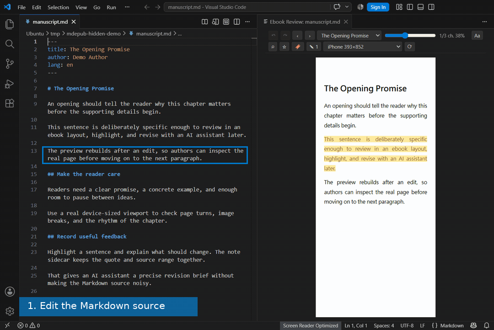
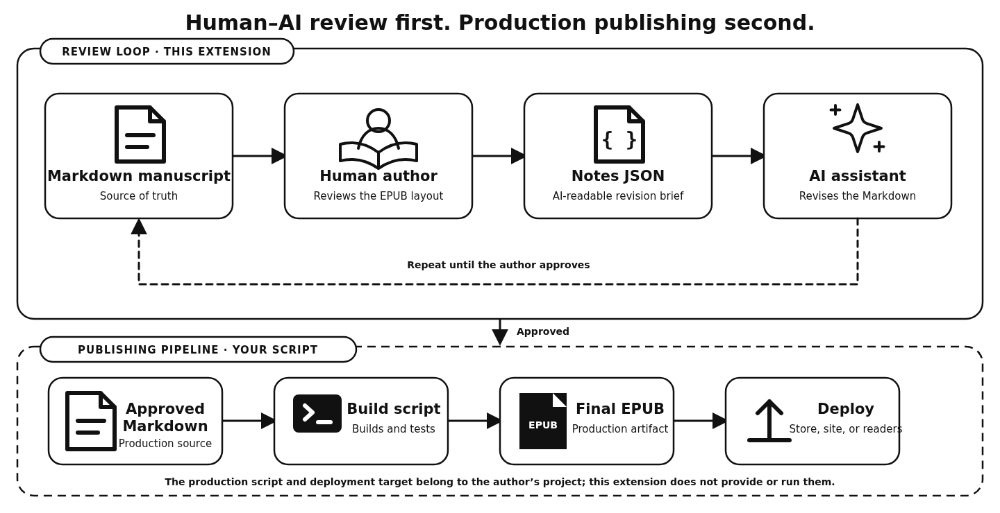
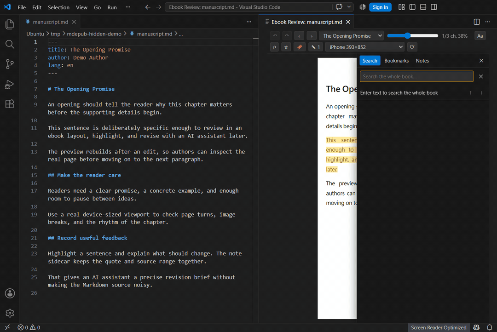
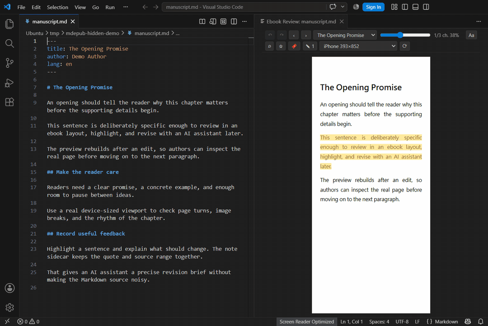
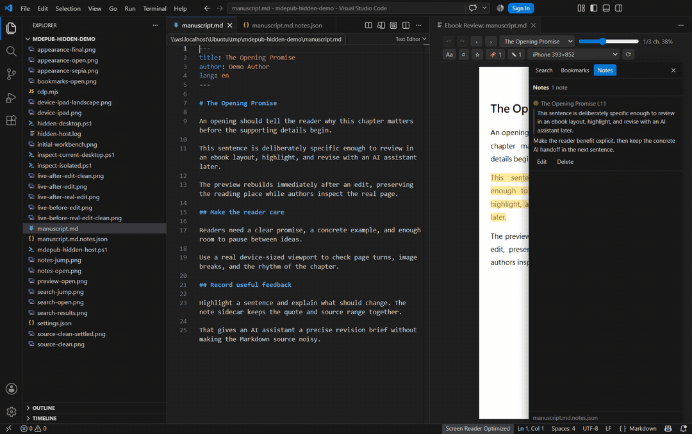
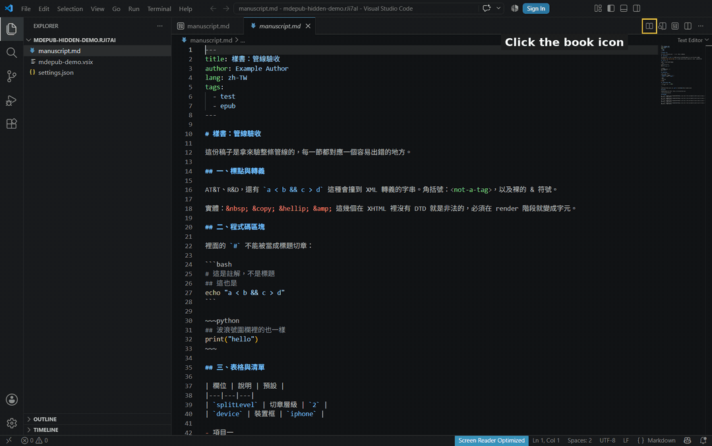

# Markdown Ebook Review — Human–AI Writing

[](https://github.com/Raxwade/markdown-ebook-review-human-ai-writing/actions/workflows/ci.yml)

## Edit, then review the same place

Edit a sentence in the Markdown pane on the left. The real EPUB reader on the
right rebuilds at the same reading location, keeping the highlighted passage in
view.



Review a Markdown manuscript as a real EPUB without leaving VS Code. Edit the
source, inspect the result in an ebook reader, and leave precise revision notes
for yourself or an AI assistant.



Markdown remains the source of truth. The extension stores annotations in a
portable `<book>.md.notes.json` sidecar, so you can give the manuscript and its
review brief to the AI workflow of your choice. It never uploads your manuscript,
calls an AI provider, or changes source text when you make a note.

## What it does

- Renders the active `.md` file with a real EPUB engine, then rebuilds the full
  preview after an edit while retaining your place.
- Lets you check pagination and image breaks at phone, tablet, e-reader,
  desktop, panel, or custom viewport sizes.
- Provides reader appearance controls, whole-book search, bookmarks, progress,
  and location history.
- Adds text and image highlights with source-linked notes kept outside the
  Markdown file.
- Exports a standards-based `.epub` beside the manuscript when you need one.

## Feature walkthroughs

### Check device-sized pagination

Switch devices or orientation without rebuilding the EPUB. The reader keeps its
declared viewport, so the pagination you review is meaningful.


### Tune the reading experience

Change type size, font, spacing, alignment, columns, reading mode, and page
theme directly in the existing reader.


### Search and save places to revisit

Search the whole book, jump to a match, and save a bookmark at the current
location.



### Leave a revision brief without touching the source

Select text or an image, choose a highlight colour, and write the instruction.
The sidecar preserves the quote, Markdown range, chapter, and note for the next
revision pass.



### Hand the revision brief to an AI

Open the generated `<book>.md.notes.json` sidecar when you are ready to revise.
It keeps the source range, quoted text, and instruction together without
modifying the manuscript.



## Quick start

1. Open any Markdown file in VS Code.
2. Select the book icon in the editor title bar to open EPUB Preview. You can
   also run **Markdown Ebook Review: Open EPUB Preview** from the Command
   Palette.

   
3. Read, search, bookmark, and add notes. For an AI revision pass, provide the
   Markdown file together with its `<book>.md.notes.json` sidecar.

## Commands

| Command | What it does |
|---|---|
| `Markdown Ebook Review: Open EPUB Preview` | Opens the live EPUB preview beside the editor. |
| `Markdown Ebook Review: Export EPUB` | Writes an EPUB beside the active Markdown file. |

## Install a VSIX

Build a VSIX from this repository:

```bash
npm install
npm run package
code --install-extension markdown-ebook-review-human-ai-writing-*.vsix --force
```

Then reload VS Code with **Developer: Reload Window**. You can also run
**Extensions: Install from VSIX…** and choose an existing package.

## Privacy and export

- Highlights and comments never modify the Markdown source. They live in
  `<book>.md.notes.json` beside it.
- The extension has no embedded AI service: your manuscript stays local unless
  you choose to share it elsewhere.
- `Export EPUB` writes a standards-based file beside the manuscript for
  inspection or simple manual distribution.

## More detail

- [Markdown compatibility](docs/markdown-compatibility.md)
- [Architecture and technical decisions](docs/architecture.md)
- [Contributing](CONTRIBUTING.md)
- [Changelog](CHANGELOG.md)

For bugs or feature requests, open a [GitHub issue](https://github.com/Raxwade/markdown-ebook-review-human-ai-writing/issues). Security reports follow the
[security policy](SECURITY.md).

## License

ISC. See [LICENSE](LICENSE) and [third-party notices](THIRD_PARTY_NOTICES.md).
